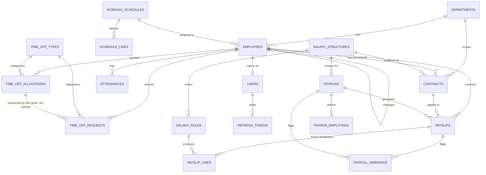

# DB_GUIDE.md — PeoplePay360 Database Authority

Postgres, node-pg (raw parameterized SQL), node-pg-migrate. No ORM. This file is the single
source of truth for schema — read it before writing any query or migration.

## Golden Rules

1. **Always parameterized queries.** `$1, $2...` placeholders via `pg`. Never string-concatenate
   user input into SQL, ever, "hackathon" is not an exception.
2. **Always name columns.** Never `SELECT *`. Name what you need — it documents the query and
   survives schema changes without silently breaking callers.
3. **Always check `rows.length` before touching `rows[0]`.** A missing row is a 404, not a
   crash on `undefined.property`.
4. **Always use a transaction for multi-table writes.** `BEGIN` → statements → `COMMIT`, with a
   `ROLLBACK` in the `catch`. Anything that writes to more than one table (or writes+deletes) is
   multi-table.
5. **Never store a total that a form can edit, and never let the frontend compute one and send
   the result.** See the Ledger Pattern below — it governs payslips and leave balances.

## THE LEDGER PATTERN (applies to Payslips and Leave Allocations)

**Payslip totals.** `payslips` has NO `gross`/`net` column. A payslip's Basic, Allowances,
Deductions, Gross, and Net are rows in `payslip_lines` (one row per salary rule that fired).
Net pay is read as `SELECT amount FROM payslip_lines WHERE payslip_id = $1 AND category = 'net'`.
Gross is read the same way with `category = 'gross'`. This is enforced structurally, not by
convention: there is nowhere on `payslips` to store a number that could drift from the lines
that produced it.

**Atomic write — Payrun "Compute" action** (`services/payrollEngine.js` → one DB transaction
per employee in the run):

```sql
BEGIN;
  -- wipe any prior computation for this payslip (idempotent recompute)
  DELETE FROM payslip_lines WHERE payslip_id = $1;

  -- bulk-insert the freshly computed rule outputs (one row per fired salary rule,
  -- built in Node from salary_rules ordered by sequence, see API_GUIDE service layer)
  INSERT INTO payslip_lines (payslip_id, salary_rule_id, code, name, category, sequence, amount)
  SELECT * FROM UNNEST($2::uuid[], $3::uuid[], $4::text[], $5::text[], $6::text[], $7::int[], $8::numeric[]);

  UPDATE payslips SET status = 'computed', worked_days = $9, updated_at = now() WHERE id = $1;
COMMIT;
```

Never a separate "recompute the total and overwrite `payslips.net`" step — there is no such
column to overwrite.

**Leave allocations.** `time_off_allocations` is the *grant* (written once when HR approves an
allocation — `allocated`, `valid_from`, `valid_to`). It has NO `taken` or `remaining` column.
`time_off_requests` are the *movements* against that grant. Taken/remaining are always computed
live:

```sql
SELECT
  a.allocated,
  COALESCE(SUM(r.duration) FILTER (WHERE r.status = 'approved'), 0) AS taken,
  a.allocated - COALESCE(SUM(r.duration) FILTER (WHERE r.status = 'approved'), 0) AS remaining
FROM time_off_allocations a
LEFT JOIN time_off_requests r ON r.allocation_id = a.id
WHERE a.id = $1
GROUP BY a.id;
```

**Atomic write — approving a Time Off Request** (this is the only place a request's status
changes to `approved`; it never independently touches the allocation row):

```sql
BEGIN;
  UPDATE time_off_requests
  SET status = 'approved', approved_by = $2, decided_at = now()
  WHERE id = $1 AND status = 'submitted'
  RETURNING allocation_id, duration;
  -- if 0 rows returned: request was already decided or doesn't exist → 409, ROLLBACK, no further work
COMMIT;
```
Because `remaining` is always a live `SUM`, there is nothing else to update — the balance is
correct the instant the request row commits. This is also why over-allocation is checked at
approval time with a `SELECT ... FOR UPDATE` on the allocation row first (see below), not by
trusting a cached remaining value.

## "Only one active X at a time" — DB-level guards, not read-then-write

**Contracts — no concurrent active contracts per employee.** Enforced by a Postgres exclusion
constraint, not application logic (a race between two HR users creating overlapping contracts
is impossible at the DB level, not just discouraged):

```sql
CREATE EXTENSION IF NOT EXISTS btree_gist;

ALTER TABLE contracts
  ADD COLUMN date_range daterange GENERATED ALWAYS AS
    (daterange(date_start, COALESCE(date_end, 'infinity'::date), '[]')) STORED;

ALTER TABLE contracts
  ADD CONSTRAINT no_overlapping_active_contracts
  EXCLUDE USING gist (employee_id WITH =, date_range WITH &&)
  WHERE (status = 'active');
```
A second `INSERT`/`UPDATE` that would create an overlapping active contract for the same
employee raises `23P01 exclusion_violation` — the controller catches that specific Postgres
error code and returns `409 Conflict` with a clear message, never a generic 500.

**Payslips — no duplicate payslip per employee per payrun.** Enforced the same way, by
constraint rather than a UI warning alone:
```sql
ALTER TABLE payslips ADD CONSTRAINT one_payslip_per_employee_per_payrun UNIQUE (payrun_id, employee_id);
```
The Payrun Processing screen's "duplicate payslip" warning (PS section B6) is a *pre-emptive*
UI surface of this same constraint — checked before insert so the user sees the warning as a
warning, not as a raw 409 from a failed insert.

## Entity-Relationship Diagram

Renders natively on GitHub — always kept in sync with the migration by hand, since it's text
next to the schema it describes, not a separate drawing that can drift.



## Table Reference

| Table | Key columns | Relationships |
|---|---|---|
| `users` | id, email (citext, unique), password_hash, role (enum text), employee_id (nullable FK) | 1:1 optional → `employees` |
| `departments` | id, name (unique) | 1:N → `employees`, `contracts` |
| `working_schedules` | id, name, schedule_type | 1:N → `schedule_lines`; 1:N → `employees` |
| `schedule_lines` | id, schedule_id, day_of_week, start_time, end_time, break_minutes | N:1 → `working_schedules` |
| `employees` | id, employee_code (unique), names, email (unique), department_id, manager_id (self-FK), schedule_id, employee_type, status, hire_date, bank_account_number | N:1 → `departments`, self N:1 → `employees` (manager), N:1 → `working_schedules`; 1:N → `contracts`, `attendances`, `time_off_requests`, `time_off_allocations` |
| `contracts` | id, employee_id, department_id, position, wage, salary_structure_id, date_start, date_end, status, date_range (generated) | N:1 → `employees`, `salary_structures`; exclusion constraint above |
| `salary_structures` | id, name (unique), active | 1:N → `salary_rules`, referenced by `contracts`, `payruns` |
| `salary_rules` | id, structure_id, name, code, category, sequence, computation_method, amount, percentage, base_code, formula, active | N:1 → `salary_structures`; unique(structure_id, code) |
| `time_off_types` | id, name (unique), unit, requires_allocation, payroll_integrated | 1:N → `time_off_allocations`, `time_off_requests` |
| `time_off_allocations` | id, employee_id, time_off_type_id, allocated, valid_from, valid_to, status, approved_by | N:1 → `employees`, `time_off_types`; 1:N → `time_off_requests` |
| `time_off_requests` | id, employee_id, time_off_type_id, allocation_id (nullable), date_from, date_to, duration, status, approved_by, decided_at | N:1 → `employees`, `time_off_types`, `time_off_allocations` |
| `attendances` | id, employee_id, check_in, check_out, worked_hours (generated), status, is_manual_correction, corrected_by | N:1 → `employees` |
| `payruns` | id, name, salary_structure_id, period_start, period_end, status, created_by | N:1 → `salary_structures`; 1:N → `payrun_employees`, `payslips` |
| `payrun_employees` | payrun_id, employee_id (composite PK) | join table, Step-2 wizard selection |
| `payslips` | id, payrun_id, employee_id, contract_id, structure_id, period_start, period_end, worked_days, status | N:1 → `payruns`, `employees`, `contracts`, `salary_structures`; unique(payrun_id, employee_id); 1:N → `payslip_lines`, `payroll_warnings` |
| `payslip_lines` | id, payslip_id, salary_rule_id, code, name, category, sequence, amount | N:1 → `payslips`, `salary_rules` — immutable once inserted, ledger rows |
| `payroll_warnings` | id, payslip_id (nullable), payrun_id (nullable), warning_type, message, resolved | scoped to either a payslip or a whole payrun |
| `refresh_tokens` | id, user_id, token_hash, expires_at, revoked | N:1 → `users` |

All tables: `created_at timestamptz default now()`; mutable tables also get
`updated_at timestamptz default now()` maintained by the app layer (`UPDATE ... SET updated_at = now()`
in the same statement as the actual change — no triggers, keeps logic visible in the query).

## Real Key-Join Patterns From The Core Workflows

**1. Applicable contract for a payrun period** (payroll must use the contract valid for the
period, never "whatever is currently active"):
```sql
SELECT id, wage, salary_structure_id, position
FROM contracts
WHERE employee_id = $1
  AND status = 'active'
  AND date_range && daterange($2::date, $3::date, '[]')
LIMIT 1;
-- 0 rows => INSERT INTO payroll_warnings (payslip_id, warning_type, message)
--           VALUES ($4, 'contract_missing', 'No active contract covers this period');
```

**2. Employee list with related-record counts for the Employee Form smart buttons** (PS B2):
```sql
SELECT
  e.id, e.first_name, e.last_name, e.status,
  (SELECT count(*) FROM contracts c WHERE c.employee_id = e.id) AS contract_count,
  (SELECT count(*) FROM time_off_requests r WHERE r.employee_id = e.id AND r.status = 'submitted') AS pending_time_off_count,
  (SELECT count(*) FROM attendances a WHERE a.employee_id = e.id AND a.status IN ('missing_checkout','absent')) AS attendance_exception_count
FROM employees e
WHERE e.id = $1;
```

**3. Payroll Dashboard — Salary Cost by Department, live, filtered by period** (PS B9 / A7,
never a hardcoded chart):
```sql
SELECT d.name AS department, COUNT(DISTINCT p.employee_id) AS headcount,
       COALESCE(SUM(pl.amount) FILTER (WHERE pl.category = 'net'), 0) AS total_net_cost
FROM payslips p
JOIN employees e ON e.id = p.employee_id
JOIN departments d ON d.id = e.department_id
JOIN payslip_lines pl ON pl.payslip_id = p.id
WHERE p.status = 'paid'
  AND p.period_start >= $1 AND p.period_end <= $2
GROUP BY d.name
ORDER BY total_net_cost DESC;
```

## Effective-Dated Records (why Contracts are never edited in place)

Per `docs/research/odoo-hackathon-winning-tactics.md` §4: the standard failure mode in naive
payroll builds is overwriting a salary/employment field in place, which silently corrupts
historical payslips the moment someone asks "what if this employee got a raise mid-cycle?"
`contracts` already avoids this by construction — a raise or role change is a **new contract
row** (new `date_start`, previous contract gets `date_end` set and `status` moves to
`'expired'`), never an `UPDATE wage` on the row a past payslip was computed against. Payslips
additionally freeze their own numbers into `payslip_lines` at compute time (see Ledger Pattern
above), so even `salary_rules` changing later never rewrites a historical payslip. Demo line:
"watch this March payslip stay correct after I give this employee a raise for April."

## Audit Log (field-level change history — Phase 2+, not a Phase-0 blocker)

```sql
CREATE TABLE audit_logs (
  id uuid PRIMARY KEY DEFAULT gen_random_uuid(),
  table_name text NOT NULL,
  record_id uuid NOT NULL,
  user_id uuid REFERENCES users(id),
  action text NOT NULL CHECK (action IN ('create','update','status_change')),
  changed_fields jsonb NOT NULL, -- { field: { old, new } }, only tracked fields, not a full-row dump
  created_at timestamptz DEFAULT now()
);
CREATE INDEX ON audit_logs (table_name, record_id);
```
Track selectively — only fields with real audit value (`wage`, `status`, `bank_account_number`,
contract dates), written in the same transaction as the change, not blanket-logged on every
column. Surfaced in the UI as a "History" tab on Employee/Contract/Payslip detail pages. This is
the Odoo `mail.thread`-equivalent pattern; see CLAUDE.md roadmap for where it sits relative to
the cut line.

## Other Domain Conventions

- **Soft delete: none.** Employees/contracts are never hard-deleted (audit + payroll history
  requirement in the PS); instead `employees.status = 'inactive'` and contracts naturally expire
  via `date_end` / `status = 'expired'`. There is no `deleted_at` column anywhere — historical
  correctness is enforced by keeping rows, not by a soft-delete flag on top of them.
- **Audit trail on corrections:** `attendances.is_manual_correction` + `corrected_by` (not a
  separate audit table for MVP — cut-line item if time allows, see CLAUDE.md).
- **Upsert-on-conflict:** not needed for MVP; the closest case (recomputing a payslip) uses the
  explicit DELETE-then-INSERT transaction above instead, because payslip_lines carry a
  meaningful row identity (which rule fired) that an upsert would obscure.
- **Money:** `numeric(12,2)` everywhere, never `float`/`double precision` — floating point
  arithmetic on salary figures is a correctness bug, not a style choice.
